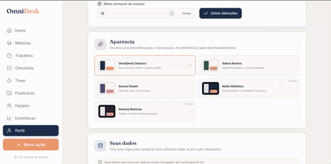
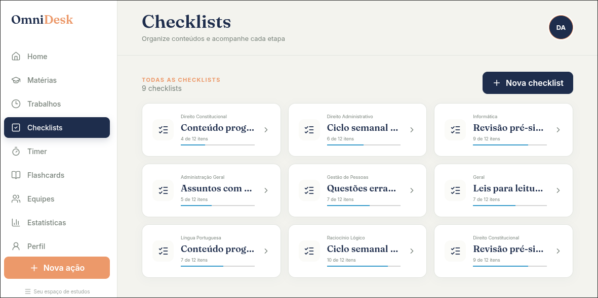
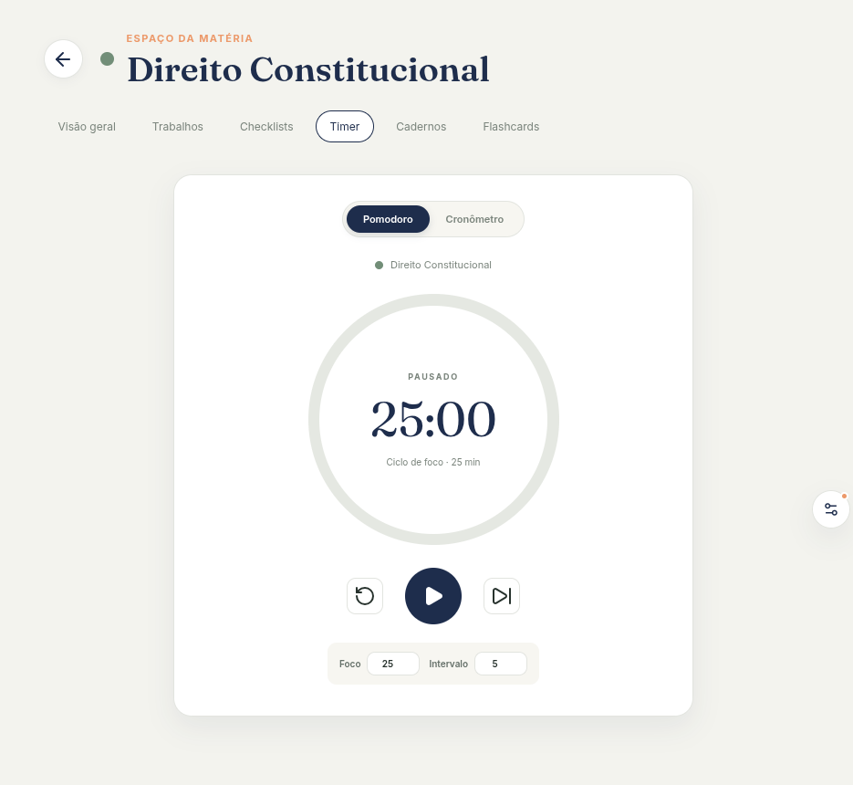
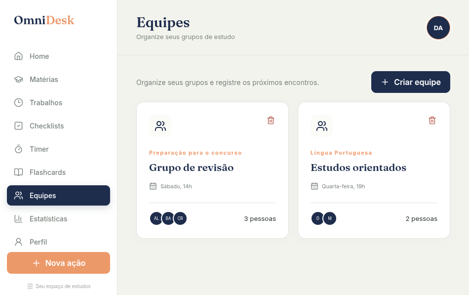
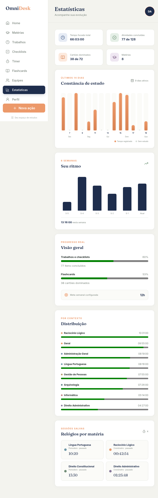

<div align="center">
  

  # OmniDesk

  **Seu espaço de estudos, organizado do seu jeito.**

  Uma plataforma acadêmica local-first para planejar conteúdos, manter o foco e acompanhar a evolução — sem conta, assinatura ou servidor.

  [](https://react.dev/)
  [](https://www.typescriptlang.org/)
  [](https://vite.dev/)
  [](LICENSE)

  [Acessar aplicação](https://omnidesk.danielgomes132005.workers.dev) · [Instalação](#executando-localmente) · [Como os dados são salvos](#privacidade-e-armazenamento)
</div>

---

<div align="center">
  
</div>

## Sobre o projeto

O OmniDesk reúne matérias, projetos, checklists, sessões de foco, flashcards, cadernos e estatísticas em uma interface limpa e responsiva. Ele foi criado para funcionar como uma central de estudos de verdade: cada ferramenta pode ser usada globalmente ou dentro do contexto de uma matéria, sem obrigar o usuário a organizar tudo da mesma maneira.

Todos os dados permanecem no navegador por padrão. A aplicação funciona sem autenticação, continua disponível offline depois do primeiro acesso e oferece backup em JSON para transferência entre dispositivos.

## Principais recursos

| Área | O que oferece |
| --- | --- |
| **Matérias** | Espaços independentes com cor, trabalhos, checklists, timer, cadernos e flashcards próprios. |
| **Trabalhos** | Projetos gerais ou vinculados a uma matéria, com descrição, prazo, prioridade, edição e conclusão. |
| **Checklists** | Listas gerais ou por matéria, seções reordenáveis, inclusão em massa e acompanhamento de progresso. |
| **Foco** | Pomodoro 25/5 e cronômetro, tanto no contexto global quanto em cada matéria. |
| **Cadernos** | Cadernos por matéria, múltiplas anotações, edição automática, renomeação e exclusão. |
| **Flashcards** | Cartões organizados por blocos, revisão interativa e controle dos cartões dominados. |
| **Estatísticas** | Histórico diário, evolução semanal, distribuição por contexto e sessões salvas. |
| **Personalização** | Foto de perfil, atalhos configuráveis e cinco temas pastéis — três claros e dois escuros. |
| **Dados** | IndexedDB, funcionamento offline, importação e exportação de backups locais. |

## Uma plataforma, cinco atmosferas

O tema altera toda a linguagem visual sem perder a identidade do OmniDesk. Estão disponíveis **OmniDesk Clássico**, **Sálvia Serena**, **Aurora Pastel**, **Noite Atlântica** e **Ameixa Noturna**.

<div align="center">
  
</div>

## Visão da interface

### Checklists estruturados

Crie seções, mova grupos, classifique itens e transforme várias linhas em uma checklist organizada de uma só vez.

<div align="center">
  
</div>

<table>
  <tr>
    <td width="50%" align="center"><strong>Timer de foco</strong></td>
    <td width="50%" align="center"><strong>Equipes de estudo</strong></td>
  </tr>
  <tr>
    <td></td>
    <td></td>
  </tr>
</table>

<details>
  <summary><strong>Ver painel completo de estatísticas</strong></summary>
  <br />
  <div align="center">
    
  </div>
</details>

## Organização global e por matéria

As ferramentas da barra lateral são visões gerais e não dependem da existência de uma matéria. Um trabalho, checklist ou flashcard pode ser criado como conteúdo **Geral** ou receber uma matéria opcional.

Quando existe vínculo, o mesmo item fica disponível em dois lugares:

```text
Visão global da ferramenta
└── reúne conteúdos gerais e de todas as matérias

Espaço de uma matéria
└── exibe apenas o conteúdo vinculado àquela matéria
```

Isso permite organizar um projeto amplo — como completar um edital — sem inventar uma matéria artificial, enquanto atividades específicas continuam próximas do respectivo conteúdo.

## Sistema de timers

O OmniDesk mantém um timer global e até um estado salvo para cada matéria. O comportamento foi desenhado para evitar sessões simultâneas ou contagens invisíveis:

- Pomodoro configurado inicialmente em 25 minutos de foco e 5 minutos de intervalo.
- O timer global representa estudos sem contexto específico.
- Cada matéria preserva seu último Pomodoro ou cronômetro pausado.
- Somente um relógio pode executar por vez, mesmo entre diferentes abas do navegador.
- Iniciar outro relógio pausa o anterior automaticamente.
- Trocar de matéria, ocultar ou fechar a aba tenta pausar e registrar a sessão imediatamente.
- Checkpoints periódicos reduzem a perda de progresso em encerramentos inesperados.
- Cronômetros são limitados a 12 horas por sessão.

## Privacidade e armazenamento

O OmniDesk é uma aplicação **local-first**. Não existe conta remota, rastreamento do conteúdo ou sincronização automática.

Os dados são persistidos no IndexedDB e separados em coleções para matérias, trabalhos, checklists, anotações, cartões, timers e estatísticas. Isso evita concentrar todo o perfil em um único registro e mantém as atualizações eficientes conforme o espaço cresce.

> [!IMPORTANT]
> Os dados pertencem ao navegador e ao dispositivo utilizados. Limpar os dados do site ou usar uma janela privativa pode removê-los. Exporte backups regularmente na página de perfil.

O backup JSON contém o espaço completo e pode ser restaurado em outro navegador. Imagens de perfil também são processadas localmente antes de serem armazenadas.

## Executando localmente

### Requisitos

- Node.js 20 ou superior
- npm

### Instalação

```bash
git clone https://github.com/Asutsuo/omnidesk.git
cd omnidesk
npm install
npm run dev
```

Abra o endereço informado pelo Vite, normalmente `http://localhost:5173`.

### Scripts

| Comando | Finalidade |
| --- | --- |
| `npm run dev` | Inicia o ambiente de desenvolvimento. |
| `npm run lint` | Executa as verificações do ESLint. |
| `npm run build` | Valida o TypeScript e gera o bundle de produção. |
| `npm run preview` | Serve localmente o bundle de produção. |
| `npm run deploy` | Compila e publica usando o Wrangler. |

## Ferramentas de demonstração

O ambiente iniciado com `npm run dev` inclui um gerador exclusivo para testes, screenshots e GIFs. O botão flutuante permite carregar cenários com conteúdo coerente:

- **Ambiente vazio**
- **Uso leve**
- **Concurso em andamento**
- **Faculdade carregada**
- **Stress test**

É possível ajustar quantidades, percentual de conclusão, intensidade, período histórico e deslocamento das datas. Uma semente torna os dados reproduzíveis, enquanto o modo apresentação esconde o painel e pausa animações durante as capturas. Use `Ctrl + Shift + D` para reabrir as ferramentas.

O gerador grava tudo em um banco `omnidesk-demo` separado. O perfil local normal permanece intacto e as ferramentas são eliminadas do bundle de produção.

## Deploy no Cloudflare

O projeto utiliza os Static Assets do Cloudflare Workers e já contém o fallback necessário para uma SPA em [`wrangler.jsonc`](wrangler.jsonc).

```bash
npm run deploy
```

Ao conectar o repositório pelo painel do Cloudflare, configure:

- **Comando de build:** `npm run build`
- **Comando de implantação:** `npx wrangler deploy`
- **Caminho raiz:** vazio, salvo quando o repositório estiver dentro de outra pasta

Como os dados são locais, cada visitante recebe um espaço independente no próprio navegador; nenhum banco remoto precisa ser provisionado para o deploy.

## Estrutura do projeto

```text
src/
├── components/     # navegação e componentes reutilizáveis
├── dev/            # cenários disponíveis apenas no npm run dev
├── pages/          # páginas e ferramentas da plataforma
├── App.tsx         # estado, navegação e regras compartilhadas
├── data.ts         # entidades, normalização e limites do domínio
├── storage.ts      # IndexedDB, migração e backups
├── timerUtils.ts   # cálculos e transições seguras dos relógios
└── index.css       # temas e variáveis globais
```

## Tecnologias

- [React 19](https://react.dev/)
- [TypeScript](https://www.typescriptlang.org/)
- [Vite](https://vite.dev/)
- [Lucide React](https://lucide.dev/)
- [IndexedDB](https://developer.mozilla.org/docs/Web/API/IndexedDB_API)
- [Cloudflare Workers](https://developers.cloudflare.com/workers/)
- CSS responsivo sem biblioteca visual

## Limitações atuais

- Não há autenticação ou sincronização automática entre dispositivos.
- O espaço disponível depende da política de armazenamento do navegador.
- Backups precisam ser exportados manualmente para transferência ou recuperação externa.
- A colaboração em equipes é organizacional e local; não há edição compartilhada em tempo real.

## Contribuindo

Issues e pull requests são bem-vindos. Antes de enviar uma alteração:

```bash
npm run lint
npm run build
```

Descreva objetivamente o problema resolvido, as decisões adotadas e, para mudanças visuais, inclua capturas comparativas quando possível.

## Licença

Distribuído sob a [licença MIT](LICENSE).

## Autor

Desenvolvido por [Asutsuo](https://github.com/Asutsuo).
